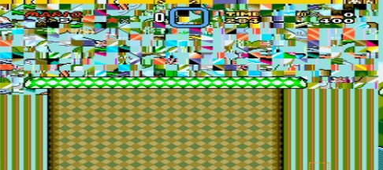
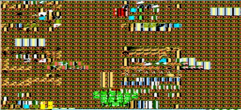
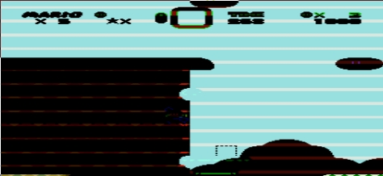
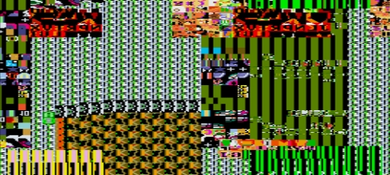
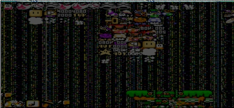
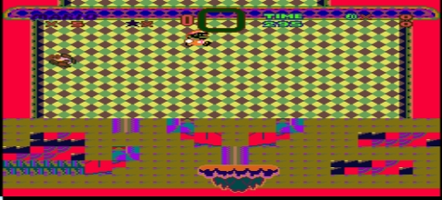
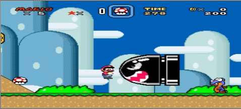

# Executive Summary

Until now our contributions to AIMEE focused on using genetic programming as a way to find a variety of interesting states. States arising from a system on which a small amount of data and the execution flow could be controlled by an attacker but no new instructions could be added.

During this stage of the project we have explored the possibility to generalize and apply some of the lessons learned until now to other systems in weird states. In particular, we have explored the possibility of using a technique known as deep reinforcement learning, to train neural network agents able to find "interesting" results by sending inputs to a video game which is on a weird state. This weird state allows playing the game under relatively normal conditions until a specific item is acquired which further modifies the program state. In this second weird state, the behaviour of the game varies widely and may even allow the system to execute code derived from the player's actions. Reinforcement learning was deemed appropriate for this approach because it can adapt to the changes in state that different inputs to the game may produce over time.

Reinforcement learning is based on rewards. Therefore, we considered three main basic approaches: rewarding when a specific game counter increased; rewarding when the computer program counter had unseen instructions; and rewarding increases on the maximum brightness of the screen.

The research found that such rewards succesfully incetivize the agents to trigger execution of weird-states, since weird states can produce significantly higher rewards than normal use of the game. The research additionally found that trained agents can impliclty distinguish triggers for profitable weird-state execution from triggers for unprofitable weird-state execution, demonstrating the trained agent's ability to statistically predict properties of emergent excution. Finally, the research also produced a negative result: it was found that although mean score scaled with training and rose further for more powerful, compute-intensive agent types, these factors don't improve an agent's chance to earn extrme high scores. This may be a result of the agent prioritizing mid-gain lower risk strategies over huge-gain and high risk ones. A second and related cause may be the inability of reinforcement learning agents to continue searching for new strategies after discovering a reliable strategy. 

In general, it was found that reinforcement learning is promising for researching statistical patterns in emergent-execution spaces, but maye be less promising as a direct technique for 'proof by demonstration' exploitation studies. The negative part of the conclusion remains tentative, since resource limitations ruled out experimenting with industrial-scale deep reinforcement learning, and deep reinforcement learning is known to be sensitive to scale. 

Future work will aim to integrate deep reinforcement learning and our genetic programming techniques. The literature suggests that hybrid reniforcement/genetic tecniques are well-suited for conditions where pure reniforcement learning prematurely settles on a mediocre strategy. The current iteration of our genetic programming framework Berbalang was designed for easy integration with deep-learning systems, so we expect the integration process to be rapid. 

# Overview


The purpose of our AIMEE Weird Mario project is to use ML techniques to study regularities in emergent execution in a setting where the user’s input primitives are far from the natural level of abstraction of the program’s control flow. 


We use the emulated SNES video-game environment as a logistically efficient proxy to the case exploiting complex applications by means of highly constrained user input---constrained, in this case, to a small alphabet of control signals: up, down, right, left, A, B, X, Y, select, left-pad, right-pad. Working within an emulated video-games environment has two crucial advantages: 


First, there is a strong foundation of existing open source infrastructure for interfacing ML algorithms with an emulated SNES environment, as well as well-developed best-practices regarding the appropriate learning algorithms, network architectures, and hyperparameters for deep reinforcement learning in arcade environments.


Second, exploitation of emulated SNES games is an active and well-documented area of amature ‘straw hat’ exploitation research. The exploitation terrain of the SNES game Super Mario World, in particular, has been extensively albeit non-systematically studied and documented by speed-runners, modders, and recreational hackers. 


When programming a weird machine by ‘playing’ a video game, one generally cannot hope for stable semantics at the level of input subsequences. E.g. the semantics of input subsequences is unlikely to be stable under permutation of the order of subsequences. Instead, one might hope to demonstrate that an ML algorithm can learn general (for the given weird machine) strategies for context-dependent action. In a way such that the algorithm implicitly applies equivalent or related abstract program-manipulations using different input-sequences in different circumstances. 


The ideal demonstration of a learnable general (for the given weird machine) strategy would be training an agent to discover very long chains of distinct weird states. This is because in order to maintain compositionality when acting in a previously unseen weird state the agent must apply previously learned principles to a novel situation. Learning to maintain compositionality requires powerful generalization that applies not only ‘horizontally’, across weird states encountered in different training runs, but ‘vertically’, from weird states that are accessible in early training runs that produce only short chains to weird states that appear only in longer chains and therefore do not appear often during early training. 


A weaker demonstration of a learnable general (for the given weird machine) strategy relies on adding stochasticity to the operation of the weird machine, such that the algorithm cannot simply memorize effective sequences. This is the approach traditionally used in reinforcement learning research when the learning environment is deterministic: the added stochasticity ensures that performance improvement as measured by increase of mean reward over the course of training reflects generalization. 


# Introduction: Super Mario World Exploitation

Super Mario World followed on the dynamics of prior Super Mario games while introducing new dynamics such as the ability to play with a companion called Yoshi or  additional power-ups like the ‘feather cape’. The game was significantly more complex than the original Mario Bros game, and features an early example of ‘world-driven’ video-game design, which resulted in a significant number of issues and glitches. As usual, most of these glitches have effects ranging from full game crashes to minor visual artifacts. Some of these glitches can be combined to trigger interesting side effects, including the ability to execute code introduced manually by the player.

The way in which these glitches operate differs significantly from the ROP scenarios that we studied in phase 1 of AIMEE, wherein the artificial intelligence (AI) had significant control over the state of the system. On the one hand, in the ROP scenarios the AI had free reign over a relatively large share of the system's memory, and was restricted only by a prohibition on executing new code. On the other, in the Weird Mario project the AI's on point of control over the system is the ability to enter inputs using a "virtual" controller emulating the original SNES game controller (which can be seen below). Aditionally, while on our first iteration the status of the system's memory was known and maintained during the whole execution of the attack, in these experiments the environment spontaneously varies over time in ways that are chaotically conditioned by the agent's actions, making the memory states unpredictable and therfore requiring more complex techniques. 


In the following subsections, we review the concepts necessary to understand some of the glitches used and their impact on emergent execution.

## Power-up states

In Super Mario World, the character controlled by the player can acquire a set of items that change the game mechanics slightly. Such items are known as power-ups because the mechanic changes benefit the player in some way. The game keeps track of the current state of the character using a number known as the power-up state. This number is used by the system in a variety of ways, including deciding what to do once a new power-up is acquired.

In the game, when the player acquires a power-up, instead of applying a lot of complex if/else logic conditions to decide what to do, the game chooses a table based on the number defining the current character state and then uses that table to get an address that points to some code that (when executed) carries out the desired actions. This is significantly faster and more elegant than having a large number of conditions. The problem with this approach, however, is that if for some reason the number used to decide which item to retrieve is larger than the number of items on the table, the code will instead interpret whatever data is placed on memory after the table as the item to be retrieved.

Under normal conditions, the game itself ensures that the player's power-up state, the number indicating the game-dynamics to follow, is never larger than the tables indexed making such strange behavior imposible. Despite that, if a player can somehow increase that number over the number of known states, the player can then make the game retrieve content from a location in the system's memory that was not originally intended to be used as an address for code-execution, and then run code from that address.

## Power-up incrementation

Power-up incrementation is the name given to different techniques that allow the player to increase the power-up state beyond 4 (which is the maximum number the game intended to allow). The techniques used to trigger this vary and exploit different weird behaviours that trigger under very specific corner cases. These techniques can and have been applied manually by certain players and are behind most of the glitch exploitation allowing interesting effects like directly jumping to the game ending or loading and executing a new game using code entered by the player using the controller.

Over time, faster and more reliable approaches to attain these objectives have been found and, currently, it is possible to achieve such a behavior already on the first level of the game.

## Creamsicle Mario

From the states that can be reached using the techniques mentioned above, of particular interest are the cases when this number is 6 or 22 since when acquiring certain power-ups, they allow executing code from areas that can be influenced through the player actions. With power-up state 6 the item is the 1-up mushroom which is very rare since it normally grants the player an extra life. With power-up state 22 there are several such items, including the item known as the 'standard' power-up mushroom -- a very common item that makes the character grow in size among other things. Unlike 1-up mushrooms, standard mushrooms can be saved for later use by the player under certain circumstances.

This last power-up state (power-up state 22) is also known as "Creamsicle Mario" because of the orangeish color the character acquires, and is kept across levels as long as the character does not enter in contact with any hazard or enemy. This state is also fairly stable and contained under other conditions, allowing playing the game as you normally would.

## Open bus access

Once the power-up triggering this behaviour is acquired in the Creamsicle Mario state, what’s known to SNES hackers as an ‘open bus’ anomaly takes place. To understand what this anomaly does, we have to first understand the basics of how a processor works.

Processors have different components that perform different operations on the data they contain, to allow for greater flexibility and reduce costs all these components are usually interconnected using a data bus. A data bus can be seen as something similar to the air connecting different employees in an office. When an employee wants to send a message to a colleague he can just shout the message into the air so that it will reach its destination. On the process, all other employees will also hear the information but ignore it. On a processor, the data is instead placed on a set of wires that connects all of the components handling data together so that it reaches the intended destination. In order for the right component to then process and handle the data, additional internal signals are added so that: only one of the components will put data on the wires at a time; and only the desired components read the data from the wires. With the appropriate coordination all of these components act in an ordered manner performing the intended modifications on data given by a set of instructions.

But, what happens when nobody writes into the data bus and somebody reads from it? The behaviour varies from processor to processor but on the original processor used by the SNES, the cables of the data bus act like small capacitors and keep their state for a tiny amount of time which may be enough for the destination component to read the value that the bus contained before. Going back to our example of the employees yelling data to the others in an office, this would be similar to an employee listening and acting on the echo of the data that was last yelled because everybody else was silent.

This kind of behaviour is exactly what happens when the processor tries to access a memory address that does not point to memory nor any other devices. In particular, when acquiring the power-up in the Creamsicle Mario state we mentioned above, the processor tries to execute code on a memory address that points to nowhere. The processor then uses the data bus to update the component that keeps track of the memory address from which to run instructions, sending first the higher part of it (a byte) over the data bus and then the second part of it again over the data bus. The echoes of this second part still remain on the processor bus when, shortly afterward, the processor tries to obtain the data of the next instruction to run from memory and, since nobody replies, this byte that was last written is interpreted as the next instruction to execute.


# Infrastructure 


We built our ‘Weird Mario’ experimentation platform on the basis of OpenAI Gym Retro and an open-source pytorch implementation of the PPO algorithm for [PPO algorithm for deep reinforcement learning](https://github.com/ikostrikov/pytorch-a2c-ppo-acktr-gail).


We forked and heavily modified OpenAI Gym Retro by exposing the emulated system’s program counter, thus allowing users to include a record of the content of the program counter in between agent steps in agent’s observations. 


We forked and modified our chosen pytorch PPO implementation by adding an LSTM network that, at step t, reads the program-counter record that accrue between step t-1 and step t. We also added a variety of new controllable parameters pertaining to  environment configuration and network architecture. 


We chose the PPO algorithm after informally experimenting with more basic actor-critic methods (AC2, AC3) and with replay-buffer methods (Rainbow, Rainbow IQN). We also informally experimented with model-based methods based on MuZero, a generalization of the famous AlphaGo algorithm that DeepMind researchers have successfully applied to Atari games, but found the method ineffective when scaled down to fit our smaller compute budget.  PPO emerged as the most reliable, efficient choice during this period of informal experimentation.  


# Experiments

## Basic Setup


Our setup assumes a scenario in which a player has transitioned to Creamsicle Mario on level 1, and is now entering a new level while in Creamsicle Mario state. In all our experiments, a play-episode ends when the agent ‘loses a life,’ or after 200 consecutive steps without reward. Imposing a step-limit is necessary in order to prevent never-ending ‘stuck’ episodes. We have found that a reward-independent time limit pushes the agent towards uninteresting strategies that focus on initiating weird-state escalation as quickly as possible rather than on controlling the weird-state trajectory of the weird-state escalation. 


## Design Decisions


Weird Mario PPO can deploy simultaneous training on all Super Mario World levels (a training approach sometimes known as Joint PPO), or deploy training on multiple instances of a single level. In all cases we run 20 emulated SNES instances in parallel, which we found to deliver the best FPS ratio when running our Gym Retro fork on a mid-range modern ML workstation. It’s possible that further optimization of our Gym Retro fork will allow scaling up to 60 instances with benefits to FPS. This is because unmodded Gym Retro is the product of years of optimization work iterating on OpenAI's previous arcade emulation platform Universe. Because of this, restoring perfect calibration, after the addition of a pipeline from the emulated SNES program counter to the RL agent's observation space, is a gradual process that will benefit from further iterations. 


Initial experiments suggested that Joint PPO makes learning exceedingly difficult given the already-high heterogeneity of weird-machine trajectories in each level. Therefore, we focussed our current efforts on single-level training. Our preferred level for single-level training is level 3, since level 3 is rich with interactive objects that are readily accessible for interactions upon entering the level. 


Weird Mario PPO can deploy training based on: pixel observations, program-counter observations, or both. The record of program-counter events in between agent steps is very large (around 14,000 program-counter events per step on average) and requires inherently slow sequential processing with a recurrent neural network. Consequently, we limit the observations at a step t to the first n events since step t-1. We find that on a mid-range modern ML workstation n=5000 is the maximum practical cutoff. In future work we may replace the recurrent neural network with the newly discovered ‘linearized transformer’ architecture, a new faster, lighter alternative for processing sequential data.

Training in the combined observation space reliably converges to a higher mean performance when compared to training with either of the observation spaces alone. Despite that, convergence is significantly slower. Across many different formal and informal experiments, the length cutoff for the observation of the per-step program-counter record given to the recurrent neural network appears to have a roughly linear positive effect on all aspects of learning. Since the length cut-off also linearly and drastically increases the time-complexity of both inference and training computations, we prefer a length-cutoff of n=2000 as our default. 


Weird Mario PPO can deploy a model-architecture that makes a (false) Markov independence assumption, or deploy a model-architecture that incorporates the agent’s observation-history into a new representation using an additional recurrent neural network. The computational costs of the recurrent neural network are themselves trivial but, because history-dependent representations are more fine-grained, training converges more slowly. Generally, we found history-dependence beneficial in larger-scale experiments and detrimental in smaller-scale experiments. This is to be expected since more fine-grained representations require more training data to become well-calibrated. 


Weird Mario PPO can deploy an environment wrapper such that an agent I/O interaction with the Super Mario World environment occurs every frame or, alternatively, every 4th frame. Reinforcement learning on arcade environments traditionally deploys an environment  wrapper that restricts I/O interactions to every 4th frame, repeating an agent’s action for 4 consecutive frames. Even though more fine-grained input is clearly desirable when dealing with weird states, removing this traditional simplification not only quadruples time-complexity, but can have catastrophic consequences when reward is sparse. The reason is that without action-repetition random exploration tends to ‘average out’ back to Mario’s initial position before any reward is encountered.


Weird Mario PPO can initialize Mario with an item-box mushroom (that is, artificially induce a standard-play state that allows the agent to ‘airdrop’ a powerup sprite that may be used to escalate Creamsicle Mario into a further weird state) or without an item-box mushroom. A further optional argument sets a timer that renews Mario’s item-box mushroom every 200 frames. This can be used to accelerate learning at the cost of some additional artificiality.


Weird Mario PPO has five basic reward settings to choose from: 
1. Weird Mario gives +1 reward every time the game’s Yoshi Coin counter (a memory address intended to keep count of the number of ‘Yoshi Coins’ Mario collects) goes up.
2. As per (1) but rewarding the delta.
3. Weird Mario gives +1 reward for every step in which a size n initial segment of the step’s program-counter record features a previously unseen (per episode) instruction. 
4. As per (3) but reward the delta.  
5. Weird Mario keeps track (within-episode) of the maximum screen-brightness value so far, and rewards the delta of the maximum.  


We found that reward settings in these five general formats reliably induce weird-state escalation in Weird Mario PPO. This happens because, informally speaking, the agent quickly learns that weird-state space allows for trajectories whose total reward is an order of magnitude greater than the most rewarding trajectories in the intended-state space. The principle that weird-state space is as a rule more ‘open ended’ than intended-state space also encouraged us to try integrating OpenAI’s ‘curiosity drive’ intrinsic exploration-reward formula into our reward functions, but our preliminary experiments with the method suggested that the high risk of  weird-state escalation resulting in a loop strongly deters ‘curiosity drive’ agents from weird-state escalation. 


We generally observed that clipping the rewards at +1 per step (settings 1 and 3) is beneficial for training stability, but gives the reward signal a somewhat unnatural structure. While training is easier in these two settings, settings 2 and 4 are arguably more realistic proxies to exploitation goals. Finally, it should be noted that setting 5 defines a reward entirely in terms of standard SNES outputs to the end-user. Therefore, it may be used as a proxy to pure ‘black box’ exploitation scenarios. 


Weird Mario PPO inherits the tunable hyperparameters of standard deep PPO. For all experiments, we use the hyperparameter settings Open AI researchers found optimal for training a conventional-play deep PPO agent on emulated Sega Genesis. 

## Results

We look at three kinds of results per experiment:
1. A trained model's mean score.
2. A trained model’s max score.
3. The percentage of a trained model’s runs scoring above a given high-score threshold.


We additionally look at the mean score of the set of episodes in which weird-state escalation occurred. The purpose of this additional metric is to ensure that increase in overall mean score is not merely due to the agent engaging in initial weird-state escalation more frequently but also due to the quality of the agent’s weird-state escalation trajectories improving. Since achieving weird-state escalation when initialized in the Creamsicle Mario state is not in and of itself a challenging exploitation problem, this additional metric is a crucial sanity check on the interpretation of our general  mean-score results. 


We compare our results to baselines from random agents, and to baselines from agents produced by a DeepMind trajectory tree search method known as ‘The Brute’. The method known as ‘The Brute’ takes no environment inputs at all except total episode reward, and uses a simple explore/exploit tradeoff formula to search the space of agent input sequences for record-breaking input sequences. ‘The Brute’ is known to be competitive with state of the art deep RL in certain deterministic arcade environments.    


We run all our experiments in a stochastic variant of the Weird Mario PPO environment. In the commonly-used setting where an input step occurs every 4th frame, we follow DeepMind’s stochasticity procedure and add a 25% chance the environment will repeat the action chosen in the previous step for an additional frame before switching to the new action. In the setting where an input step occurs every frame, we instead add a 5% chance of the environment ignoring a step and repeating the previous action. 

The purpose of the added stochasticity is to ensure that a trained model's mean score reflects genuine generalization, rather than memorization relying on the determinism of the environment. While one might expect that this assurance that results are ‘meaningful’ would come at the cost of raw performance, DeepMind researchers observed that the added stochasticity in fact tends to consistently mildly improve performance in deep PPO, as we have reconfirmed in the specific case of Weird Mario PPO. For this reason, although the main purpose of the added stochasticity is to ensure that mean score is a meaningful measure of generalization, we do not turn the added stochasticity off when training/testing Weird Mario PPO models with regard to max score or number of high-scoring runs. 


Note that when comparing Weird Mario PPO max score to baselines from agents generated using ‘The Brute’, we compare the performance of Weird Mario PPO in the stochasticity-added environment both to the performance of ‘The Brute’ in the original deterministic environment and to the performance of ‘The Brute’ in the stochasticity-added environment. 

Mean-score results are consistently strong compared to baselines, and reliably scale with compute. Max score results and high-score count results are less decisive, and may reflect limitations of pure deep reinforcement learning as an approach for discovering very high-scoring individual input sequences in deterministic environments. 

Weird Mario PPO max score typically beats the max score for random runs by a small margin when considering the max score at a given step-count, but trails behind when considering max score verses wall-time. Max scores from 'The Brute' runs (without added stochasticity) trail behind when measured in wall-time, but lead when measured in step-count. 

Weird Mario PPO score-values counts beat random runs handily for 'mid right tail' score values, but inconsistently for 'extreme right tail' score values. We generaly observe that high-score count for 'mid right tail' values consistently goes up with succesful deep RL training, and scales with compute investment. In contraposition to this, high-score count for 'extreme right tail' score values is unevenly responsive to standard indicators of training quality, and actively decays in later stages of training despite mean performance and 'mid right tail' performance continuing to improve. 

The principal difficulty appears to be that although in the early stages of Weird Mario PPO training mean score and max score rise together, the agent soon discovers strategies with high expected reward but low reward-variance. Strategies with low reward-variance are especially stable given the working of standard deep RL training algorithms such as PPO, since they keep the gradient of the reward-prediction network (aka the ‘value network’ or ‘critic network’) small. We informally experimented at length with introducing tweaks to PPO’s advantage computations (the formula for the impact of sampled performance on the network’s gradient) with the purpose of inducing a bias in favor of strategies with high reward-variance. Based on our results, we currently do not believe this is a promising direction: deep RL methods are famously fragile, and there may well be no ‘clean’ way to introduce such a bias. 


While these issues can make deep RL an awkward fit for emergent-execution research, which naturally tends to focus on outlier discovery in  deterministic environments, it is unlikely that the modest mean scores we have observed represent the true ceiling for current-generation deep RL agents in the Weird Mario environment. Deep RL in arcade environments is known to undergo ‘phase transitions’ when scaled to a new order of magnitude of compute, and so our experiments are not necessarily informative as to the results one should expect when investing x10 or x100 the compute to run 200 or 2000 parallel emulated SNES environments. We currently have no immediate plans to shift to these scales, which may not even be a natural fit for the intended spirit or budgetary structure of AIMEE.


One source of difficulty for Weird Mario PPO may be the heterogeneity between different implicit ‘stages’ of a successful weird-state escalation episode. In the first implicit stage, the agent traverses the level towards a power-up sprite, and must contend with the ordinary challengers of Super Mario World play (such as avoiding enemy-sprites and pitfalls) in addition to favorably arranging memory-space in anticipation of the escalation. In the second implicit stage, the agent clashes with the power-up sprite, and must optimize factors such as the trajectory, speed, and timing of the clash. Controlling the values of these factors requires mastery of standard Super Mario World play, and the effects of the values of these factors on the subsequent weird-machine escalation are highly non-linear and (in the technical sense) chaotic. In the third implicit stage, after the weird-state escalation, standard Super Mario World play is no longer relevant -- the ‘meaning’ of further agent inputs now depends on the specific context brought about by the initial weird-state escalation, and may even be null in some cases. 


While the qualitative difference between implicit ‘stages’ is itself, plausibly, a source of difficulty, this difficulty is, probably, exacerbated by the vulnerability of standard deep RL methods to causal-attribution failures in the case of long dependencies. For instance, we believe Weird Mario PPO is prone to evaluate agent actions in ‘stage three’ based on the events subsequent to these actions even in cases where the weird-state trajectory is unresponsive to agent actions after the initial weird-state escalation. It may be possible to ameliorate this problem in future work by drawing on a new technique from the literature. A recently released new method from DeepMind called ‘Synthetic Returns for Long-Term Credit Assignment’ reportedly makes great strides over standard deep RL methods in environments dominated by long-term causal dependencies, and we intend to explore integrating this new method into future work. 

On the task-design side, it may be worthwhile to spin-off new variants of our Weird Mario PPO environment that restrict the training domain to a single implicit ‘stage’. One relatively simple possibility along these lines would be to hand-craft an initial weird-state escalation whose weird-states trajectory is known to be responsive to subsequent agent-input, and initialize the environment to the first time-step after the initial weird-state escalation. 

## Upcoming Work 
Reinforcement learning has been slow to show itself in production because of its tendency to overfit to its reward function, ultimately and fundamentally limiting itself to one particular strategy of a rather myopic agent. The tendency for progress in max score not to keep pace with progress in mean score demonstrates an agent that, while balancing 'explore' and 'exploit' enough to learn complex and strategic behavior, lacks capacity for exploration over the agent-space itself. This can be translated behaviorally as the lack of ability to generalize over strategies even if the strategy discovered is good enough. 

Our aim in upcoming work is to combine genetic and reinforcement learning approaches, extending the state of the art in evolutionary reinforcement learning. This strategy consists of an outer loop enacting a genetic process of mutation and crossover on evolved agents formally defined by genotype and phenotype. These agents represent policies, allowing us to explore far broader initialization strategies than random initialization, and for complex interplay between inherited and learned behavior. This is something similar to a kind of transfer learning.

The advantage of this approach over pure deep reinforcement learning is that the resulting learning algorithm doesn’t overfit a particular policy. Instead, the genetic algorithm searches over a robust abstraction of all possible agent behaviors, allowing for a tunable and high-level explore/exploit problem. A literature review suggests that this approach is optimal for real world conditions where reward is sparse, and more importantly where initially discovered reward-patterns are misleading with regard to overall reward-structure. 


## Experiment Parameters and Plots

### E1: Green and Blue

```
timeout 6h python main.py \
  --env-name 'Experiment-1' \
  --reward 2 \
  --autoshroom \
  --trace-size 2000 \
  --rtrace-length 1000 \
  --level 4 \
  --use-linear-lr-decay \
  --recurrent-policy \
  --model 2 \
  --weird \
  --episode-length 90000 \
  --algo ppo \
  --skip \
  --use-gae \
  --lr 2.5e-5 \
  --clip-param 0.1 \
  --value-loss-coef 0.5 \
  --num-processes 20 \
  --num-steps 40 \
  --num-mini-batch 5 \
  --log-interval 5 \
  --entropy-coef 0.01 
```

Runs: 20210406-115451, 20210407-103704 

### E2: Grey and Magenta

```
timeout 6h python main.py \
  --env-name 'Experiment-2' \
  --reward 2 \
  --autoshroom \
  --trace-size 1 \
  --rtrace-length 1000 \
  --level 4 \
  --use-linear-lr-decay \
  --recurrent-policy \
  --model 0 \
  --weird \
  --episode-length 90000 \
  --algo ppo \
  --skip \
  --use-gae \
  --lr 2.5e-5 \
  --clip-param 0.1 \
  --value-loss-coef 0.5 \
  --num-processes 20 \
  --num-steps 40 \
  --num-mini-batch 5 \
  --log-interval 5 \
  --entropy-coef 0.01
```

Runs: 20210406-175543, 20210407-163704

### E7: Red and Orange

```
timeout 6h python main.py \
  --env-name 'Experiment-7' \
  --reward 2 \
  --trace-size 2000 \
  --rtrace-length 1000 \
  --level 4 \
  --use-linear-lr-decay \
  --recurrent-policy \
  --model 2 \
  --weird \
  --episode-length 90000 \
  --algo ppo \
  --skip \
  --use-gae \
  --lr 2.5e-5 \
  --clip-param 0.1 \
  --value-loss-coef 0.5 \
  --num-processes 20 \
  --num-steps 40 \
  --num-mini-batch 5 \
  --log-interval 5 \
  --entropy-coef 0.01
```

Run: 20210406-235718

### Plots

### Reward 0, Renewing Musroom, Combined Observation Agent vs. Random Agent 

## Initial Escalation Frequency
file:///home/peli/Reward%200,%20rewnewing%20mushroom,%20lstm+%20pixelspace%20vs%20random,%20raw/crash%20frequency.svg


## Screen Captures




















